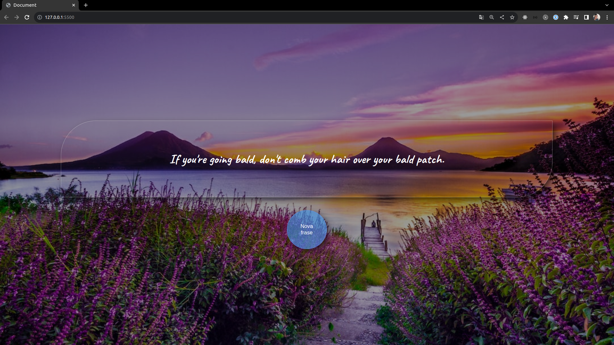

<h1 align='center'>Advices</h1>

    <a  href='#-tecnologias' > Tecnologias</a>&nbsp;&nbsp;&nbsp;|&nbsp;&nbsp;&nbsp
     <a  href='#-projeto' > Projeto</a>&nbsp;&nbsp;&nbsp;|&nbsp;&nbsp;&nbsp
      <a  href='#-layout' > Layout</a>&nbsp;&nbsp;&nbsp;|&nbsp;&nbsp;&nbsp
       <a  href='#-licença' > Licença</a>

    

 

    

##  🔧 Tecnologias
- JavaScript
- HTML
- CSS

## 💻 Projeto

Atividade do curso de Desenvolvimento Full Stack - ITalents [https://italents.com.br/](https://italents.com.br/) 

Projeto desenvolvido para pratica de consumo de api. Neste estamos utilizando a api de frases motivacionais <b>adviceslip</b> 
 

